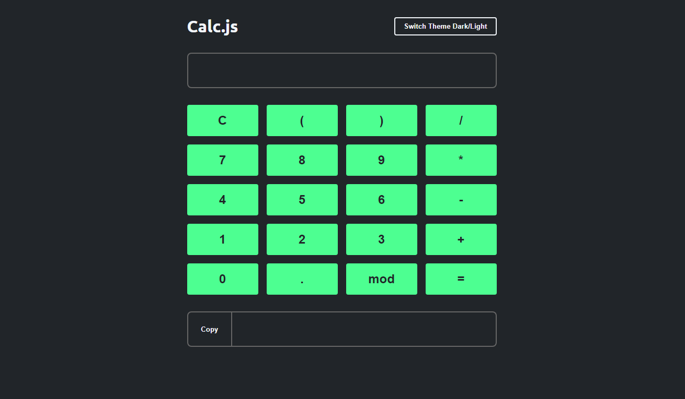

# 🖩 Calculadora em JavaScript

Este projeto é uma **calculadora funcional** desenvolvida durante os estudos no **OneBitCode**. Utiliza **HTML, CSS e JavaScript puro** para criar uma interface interativa que permite realizar operações matemáticas básicas.

## 🚀 Tecnologias Utilizadas
- **HTML5**: Estrutura da calculadora
- **CSS3**: Estilização da interface
- **JavaScript (ES6+)**: Lógica de cálculo e manipulação da DOM

## 📌 Funcionalidades
✅ Adição, subtração, multiplicação e divisão  
✅ Interface responsiva  
✅ Suporte a entrada via teclado  
✅ Exibição dinâmica do resultado  

## 🖼️ Preview

